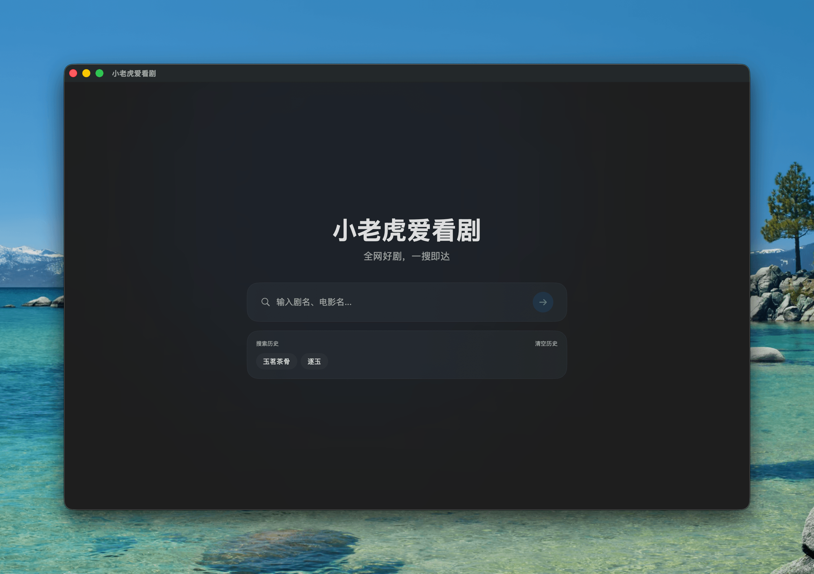
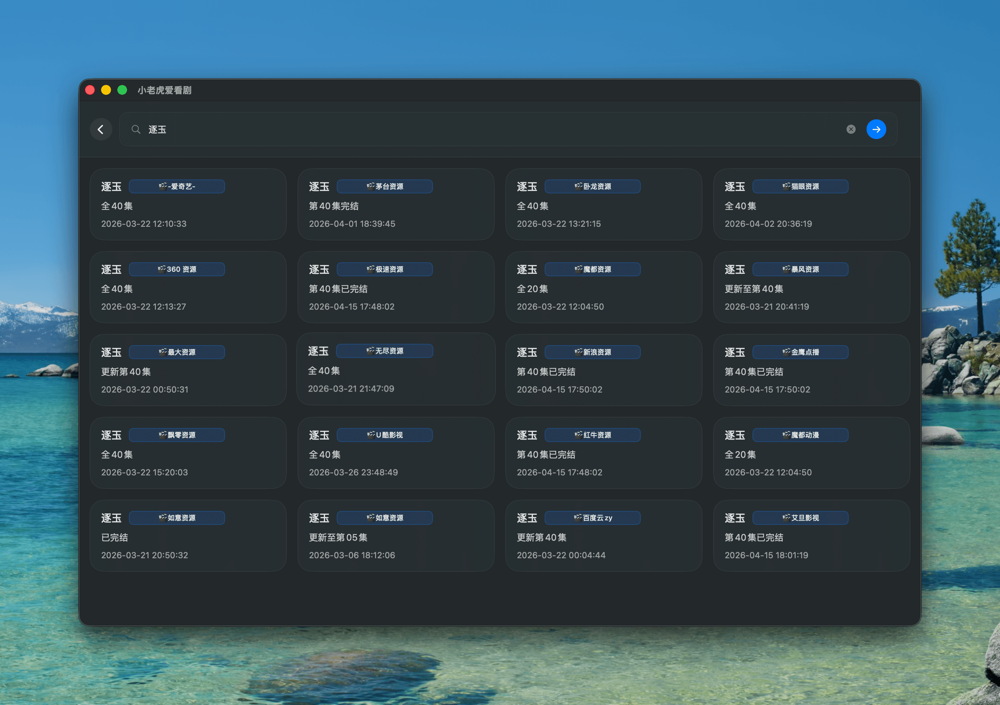
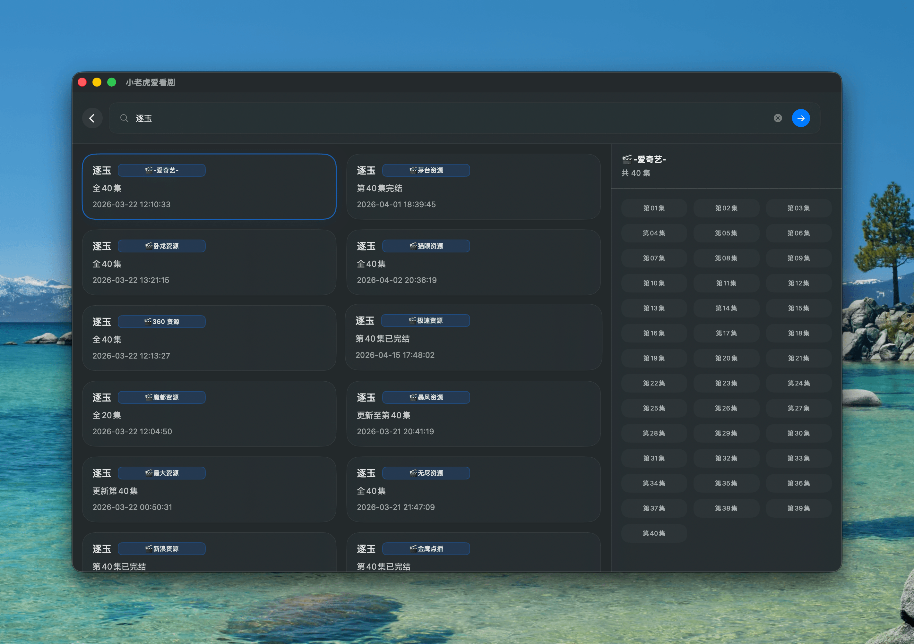
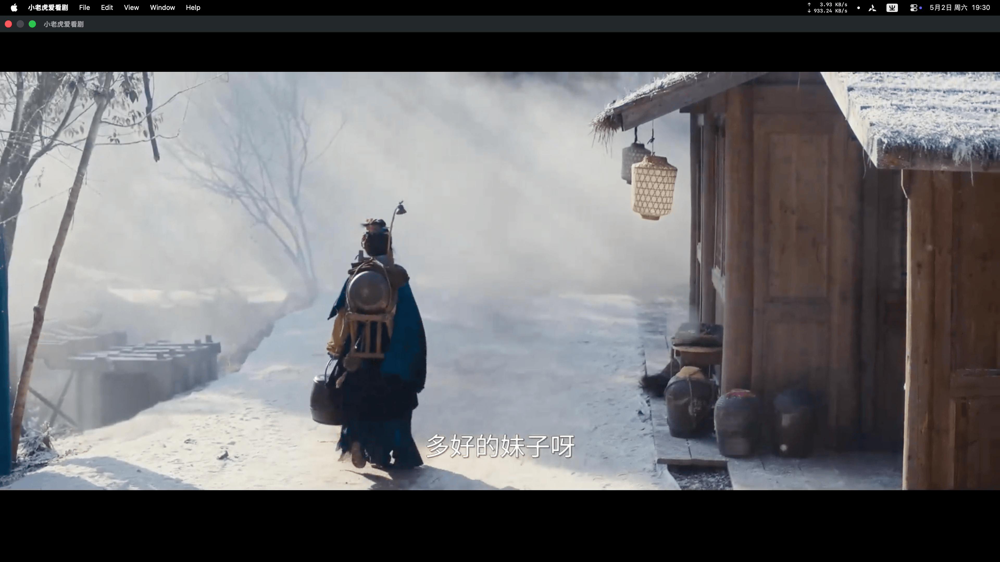

<p align="center">
  
</p>

# 小老虎爱看剧 (TigerTV)

一款 macOS 影视搜索与播放工具，同时提供命令行工具 `tigertv-cli.py` 及 Agent 可用的 `SKILL.md`。

## 特性

- **桌面应用（GUI）**：聚合多个资源站，支持搜索与播放剧集
- **命令行工具（CLI）**：搜索影视资源、获取播放/下载链接、生成 Quantumult X 规则、查看日志
- **Agent Skill**：基于 CLI 封装，能力与 CLI 完全一致

## 截图

<p align="center">
  
</p>

<p align="center">
  
</p>

<p align="center">
  
</p>

<p align="center">
  
</p>

<p align="center">
  
</p>

## 快速开始

### macOS 应用

1. 从 Releases 下载 `TigerTV.zip`  
2. 解压并拖入「应用程序」文件夹  

首次启动前执行：

```shell
xattr -cr "/Applications/TigerTV.app"
````

**系统要求：** macOS 26+

### 命令行工具

一键安装：

```bash
curl -fsSL https://raw.githubusercontent.com/qvshuo/TigerTV/main/scripts/install.sh | bash
```

如未自动加入 PATH，可手动配置：

```shell
# bash
echo 'export PATH="$HOME/.local/bin:$PATH"' >> ~/.bashrc
source ~/.bashrc

# zsh
echo 'export PATH="$HOME/.local/bin:$PATH"' >> ~/.zshrc
source ~/.zshrc
```

## 常用命令

```shell
# 搜索剧集
tigertv-cli.py search 逐玉

# 获取播放 / 下载链接（site 需完整匹配）
tigertv-cli.py fetch --site "🎬-爱奇艺-" --vod_id 73480

# 生成 Quantumult X 直连规则
tigertv-cli.py quanx 逐玉

# 查看日志
tigertv-cli.py logs
```

日志路径：

```
/tmp/tigertv-cli.log
```

## 致谢

站点配置数据来源：[LunaTV-config](https://github.com/hafrey1/LunaTV-config)

## License

MIT

